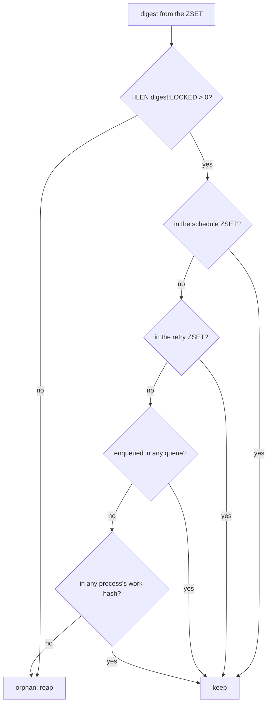

# Middleware and the server lifecycle

Everything that runs inside a Sidekiq process: the two middleware chains, the
server hooks, the orphan reaper, and the optional reliable fetch.

## 1. The two chains

Neither middleware is installed automatically. An application adds
`SidekiqUniqueJobs::Middleware::Client` to the client chain and
`SidekiqUniqueJobs::Middleware::Server` to the server chain, and calls
`SidekiqUniqueJobs::Server.configure(config)` to start the background work.

Both classes `prepend SidekiqUniqueJobs::Middleware` (`middleware.rb`), whose
`#call` (`middleware.rb:31-43`) is the shared preamble:

```ruby
return yield if item.delete(RESCHEDULED) || unique_disabled?
SidekiqUniqueJobs::Job.prepare(item)
with_logging_context { super }
```

Three consequences. A job re-pushed by the `reschedule` strategy carries
`"rescheduled" => true`, and the key is **deleted** as it is tested, so the
payload that lands in Redis is clean and the job locks normally on its next
pass. `unique_disabled?` is `!(SidekiqUniqueJobs.enabled? && lock_type)`, so a
worker with no `lock:` option, and every worker when `config.enabled` is false,
bypasses the gem entirely. And `Job.prepare` runs once per chain, so the server
recomputes the digest rather than trusting the payload.

`OptionsWithFallback` (`options_with_fallback.rb`) supplies `#lock_type` (the
merged worker options, then the item), `#lock_class`
(`SidekiqUniqueJobs.locks.fetch` — raising `UnknownLock` for an unregistered
name) and `#lock_instance`, which is `lock_class.new(item, after_unlock_hook,
@redis_pool)`.

- `Middleware::Client#call` → `lock_instance.lock { return yield }`. The block
  runs only when the lock was taken, so a duplicate is dropped by never
  reaching Sidekiq's next middleware.
- `Middleware::Server#call` → `lock_instance.execute(&block)`.

`Logging::Middleware#logging_context` tags every line with `client`/`server`
and the digest.

## 2. `SidekiqUniqueJobs::Server`

`Server.configure(config)` (`server.rb:25-32`) registers `on(:startup) { start }`,
`on(:shutdown) { stop }`, and appends `DEATH_HANDLER` to
`config.death_handlers` when the capsule responds to them — the handler deletes
the digest of a job that exhausted its retries, so a dead job does not hold a
lock forever.

`start` (`34-39`) runs `UpgradeLocks.call`, `start_metrics`, `start_reaper`,
`start_resurrector`, in that order. `stop` (`41-47`) shuts the three timer tasks
down, flushes metrics and releases the reaper mutex.

**Reaper election.** `start_reaper` (`74-93`) returns early when
`reaper_disabled?` — true only for `nil`, `false` and `:none`, so any other
value including `:lua` runs the same Ruby reaper. It then tries
`register_reaper_process`: `SET uniquejobs:reaper <pid> NX EX <mutex_ttl>`,
where `mutex_ttl` (`162-165`) is `reaper_interval + (reaper_interval *
DRIFT_FACTOR).ceil` and `DRIFT_FACTOR` is `0.02`. Exactly one process wins; the
winner runs a `TimerTask` every `reaper_interval` seconds that refreshes the
mutex and then reaps.

**Resurrection.** `start_resurrector` (`99-111`) returns early when the reaper
is disabled or when this process already owns `@reaper_task`, so it runs in the
processes that did *not* win, on a `reaper_interval * 2` timer.
`resurrect_reaper` (`113-121`) takes over only when this process has no running
reaper task and the mutex key is gone; `reaper_registered?` returns `true` if
Redis cannot be read, so a process that cannot see Redis never steals the role.
Note that `config.reaper_resurrector_interval` and
`reaper_resurrector_enabled` are still config members but no longer consulted
here.

**Metrics.** `start_metrics` (`174-186`) creates a `LockMetrics`, subscribes to
`unlock_failed` and `execution_failed`, and flushes to Redis on a 60-second
timer.

`SidekiqUniqueJobs::TimerTask` (`timer_task.rb`) is a vendored
`Concurrent::RubyExecutorService` subclass; all three tasks are created with
`run_now: false`, so nothing fires during the boot hook itself.

## 3. `Orphans::Reaper`

One class (`orphans/reaper.rb`), driven by `Server.reap`, which logs and returns
`0` on any error.

`find_orphans` (`50-74`) pages `Digests#byscore(0, max_score, …)` in pages of
`reaper_count * 2`, where `max_score` (`204-206`) is `now - reaper_timeout -
GRACE_PERIOD` (10s) — a digest younger than that is never a candidate. It
collects up to `reaper_count` digests and stops on `timeout?` (`208-210`), which
is `reaper_timeout * 1000` ms from construction.

`belongs_to_job?` (`78-85`) is the definition of "not an orphan":



Every branch that can run out of information answers "keep". `in_sorted_set?`
(`94-111`) returns `true` the moment `timeout?` is true; `enqueued?` (`115-126`)
returns `true` when `queues_very_full?` (`186-196`) finds more than
`MAX_QUEUE_LENGTH` (1000) jobs across all queues, because it cannot read them
all; `digest_in_queue?` (`158-182`) pages `LRANGE` in blocks of `PAGE_SIZE`
(50), re-reading `LLEN` each pass and clamping `range_start` to 0 so concurrent
pops cannot drive the window negative; `active?` (`129-156`) walks
`SMEMBERS processes` and each `<process>:work` hash, comparing
`payload["lock_digest"]` with the `:RUN` suffix stripped from both sides. Only
`locked?` (`88-90`) answers "orphan", and it does so on positive knowledge: an
empty LOCKED hash.

Deletion goes through `BatchDelete.call(orphans, conn)` (`198-202`), which
pipelines `UNLINK <digest>:LOCKED` + `ZREM uniquejobs:digests <digest>` in
slices of `BATCH_SIZE` (500) on the reaper's own connection.

## 4. `Fetch::Reliable` (opt-in)

Set `config[:fetch_class] = SidekiqUniqueJobs::Fetch::Reliable` to replace
Sidekiq's fetcher (`fetch/reliable.rb`).

`#initialize` (`36-47`) builds `identity = "#{hostname}:#{pid}:#{hex(6)}"` — the
random suffix is what keeps a recycled PID from adopting another run's working
list — starts the heartbeat thread, then runs `recover_orphans` **synchronously**.

- `#retrieve_work` (`55-73`) — when more than one queue is configured, a
  non-blocking `fetch.lua` on every queue but the last; then a blocking `BLMOVE`
  on the last with a 2-second `TIMEOUT`. With one queue only the blocking path
  runs, and it validates the lock in Ruby (`validate_lock`, `127-138`) instead
  of in Lua.
- `fetch.lua` moves the job with `LMOVE queue working RIGHT LEFT` and returns
  `[job, lock_valid]`, where `lock_valid` is `HEXISTS <digest>:LOCKED <jid>`.
  A `0` there means the lock vanished while the job waited, and the fetcher
  reflects `:uniqueness_lapsed` — it does **not** drop the job.
- `#recover_orphans` (`174-210`) — `SCAN` for `uniquejobs:working:*` to cursor
  `"0"`, skip this process's own key and any identity whose heartbeat key still
  exists, then `LRANGE` the list, `RPUSH` each job back onto its own queue
  (`queue:default` when the payload will not parse) and `UNLINK` the working
  list. `RPUSH` puts a recovered job at the tail — the end Sidekiq pops from —
  so it is taken before jobs pushed while the process was down.
- `UnitOfWork#acknowledge` (`233-253`) — `ack.lua` with the working list, the
  LOCKED hash and the digests ZSET, but only when the payload carries both a
  digest and a JID; otherwise, and on any error, a bare `LREM` so the job leaves
  the working list regardless.
- `#bulk_requeue` (`78-97`) sets `@done`, joins the heartbeat thread, and
  pipelines `RPUSH` + `LREM` per job. Locks are left alone: the requeued job
  still holds its lock and will find it on the way back in.

## Related

- [`../lock-model/summary.md`](../lock-model/summary.md) — what `lock_instance` does
- [`../lua-scripts/summary.md`](../lua-scripts/summary.md) — `fetch.lua`, `ack.lua`
- [`../review/orphans-and-fetch.md`](../review/orphans-and-fetch.md) — accepted review findings here
